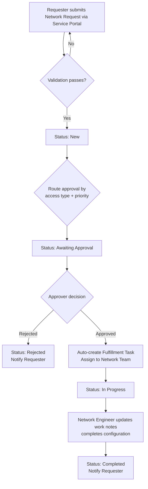

# Workflow / State Diagram

## Notification Points
1. Request submitted → confirmation to Requester
2. Awaiting approval → email to Approver with approve/reject links
3. Approved/Rejected → notify Requester
4. Task assigned → notify Network Team member
5. Task completed → notify Requester with closure summary

## State Model (sc_request / sc_req_item)
`New → Awaiting Approval → In Progress → Completed`
(with `Rejected` and `Cancelled` as terminal side-states)
